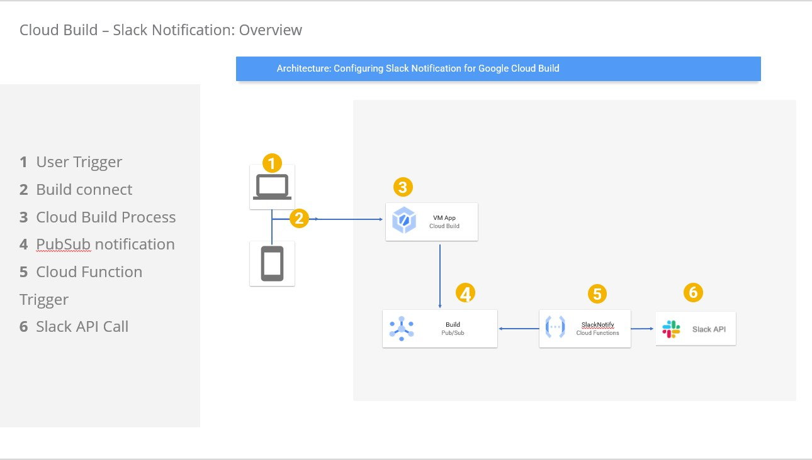

# gcp-cloud-build-slack-notify
Demonstration of slack notification for Cloud Build status


## Architecture



## Steps
1. Create a [new Slack App](https://api.slack.com/apps?new_app=1)
2. Note down webhook 
3. Update webhook in Cloud Function index.js
4. Deploy the cloud function
5. Trigger Cloud Build say by running the command in Google Cloud Shell
6. Check notification in Slack Channel


## Cloud Function
Run npm install inside the cloud function folder. Put proper webhook code
for SLACK_WEBHOOK_URL. Finally deploy the cloud function.

### Deploying cloud function
```bash
supermano@cloudshell:~ (norse-objective-324103)$ gcloud functions deploy --runtime=nodejs14 subscribe --stage-bucket xc-vm-migration-notif-config --trigger-topic cloud-builds
```

## Slack Notification
